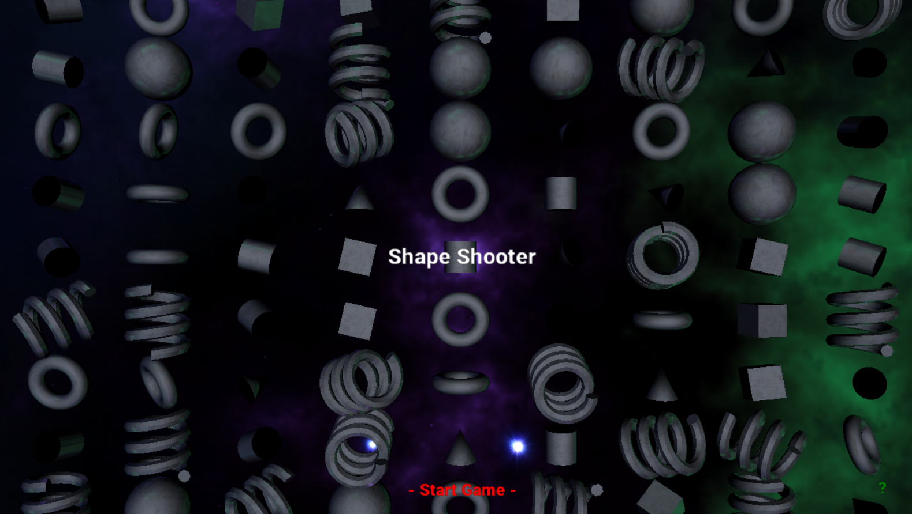

# Shape Shooter

This is a small game created with a custom DirectX 11 Rendering Engine. The goal is to shoot shapes with ammo that matches the target shape.

## The Engine
For more details on the engine, FT Engine, see its [associated repo](https://github.com/dan-singer/ft-engine).

## Contributions
This project was developed at RIT by Michael Capra, Michelle Petilli, Dan Singer, and Julian Washington. Starter code was provided by [Chris Cascioli](https://www.rit.edu/directory/cdccis-chris-cascioli).